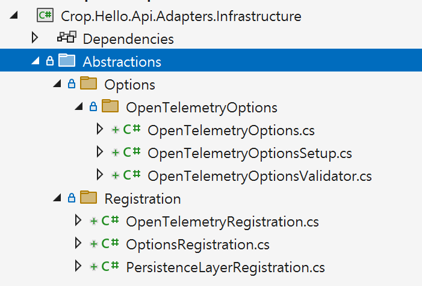

# 레이어 의존성 주입(옵션 패턴)

## 목표
- [x] 옵션 패턴
- [x] 레이어 의존성 주입
- [x] 관찰 가능성 콘솔 로그
- [x] 콘솔 통합 테스트

## TODO
- [ ] .

## 의존성 폴더 구성


- `Abstractions` 폴더
  - 레이어의 주요 목표와 직접 관련이 없는 모든 코드는 Abstractions 폴더에서 관리합니다.
    - 의존성 등록: Registrations
    - 옵션: Options

## 옵션 패턴

```
appsettings.json
  -> {Featrue}Options
  -> {Feature}OptionsSetup : IConfigureOptions<{Feature}Options>
  -> {Feature}OptionsValidator : IValidateOptions<{Feature}Options>
```
- 옵션 데이터: XyzOptions
- 옵션 데이터 읽기: IConfigureOptions
- 옵션 유효성 검사: IValidateOptions

```cs
// {Feature}: OpenTelemetry

// 옵션 데이터
public sealed class {Featrue}Options
{
  // 옵션 데이터
}

// 옵션 데이터 읽기(appsettings.json)
internal sealed class {Feature}OptionsSetup(IConfiguration configuration) : IConfigureOptions<{Feature}Options>
{
  private const string _configurationSectionName = nameof({Feature}Options);
  private readonly IConfiguration _configuration = configuration;

  public void Configure({Feature}Options options)
  {
    _configuration
      .GetSection(_configurationSectionName)
      .Bind(options);
  }
}

// 옵션 유효성 검사
internal sealed class {Feature}OptionsValidator : IValidateOptions<{Feature}Options>
{
  public ValidateOptionsResult Validate(string? name, {Feature}Options options)
  {
    string validationResult = string.Empty;

    if (options.{실패 조건})
    {
      validationResult += "{실패 이유}";
    }

    // 옵션 실패 조건 ...

    if (!validationResult.IsNullOrEmptyOrWhiteSpace())
    {
      return ValidateOptionsResult.Fail(validationResult);
    }

    return ValidateOptionsResult.Success;
  }
}
```

## 레이어 의존성 주입

- 패키지
  - OpenTelemetry.Extensions.Hosting
  - OpenTelemetry.Exporter.Console
  - __OpenTelemetry.Exporter.OpenTelemetryProtocol__

```cs
internal static class OpenTelemetryRegistration
{
  internal static IServiceCollection RegisterOpenTelemetry(
    this IServiceCollection services,
    ILoggingBuilder logging,
    IHostEnvironment environment,
    IConfigurationManager configuration)
  {
    var openTelemetryOptions = services.GetOptions<OpenTelemetryOptions>();
    bool useOnlyConsoleExporter = openTelemetryOptions.IsLocal();

    logging.AddOpenTelemetry(options =>
    {
      options.IncludeScopes = true;
      options.IncludeFormattedMessage = true;

      if (useOnlyConsoleExporter)
      {
        options.AddConsoleExporter();
      }
      else
      {
        //options.AddOtlpExporter(options => ConfigureOtlpCollectorExporter(options, openTelemetryOptions.OtlpCollectorHost));
      }

      // Resource associated with LogRecord:
      //  - service.name
      //  - service.version
      options.SetResourceBuilder(ResourceBuilder.CreateDefault().AddService(
        serviceName: openTelemetryOptions.ApplicationName,
        serviceVersion: openTelemetryOptions.Version));

      // 분산 추적과 로그 데이터 간의 연관성 지정합니다.
      //  - 로그가 완료되면 LogRecord의 메시지를 추출하여 현재 Activity에 이벤트로 추가합니다.
      options.AddProcessor(new ActivityEventLogProcessor());
    });

    return services;
  }

  // ActivityEventLogProcessor는 LogRecord와 OpenTelemetry의 Activity를 연결하는 데 사용됩니다.
  //  로그가 완료되면 LogRecord의 메시지를 추출하여 현재 Activity에 이벤트로 추가합니다.
  //  이를 통해, 분산 추적과 로그 데이터 간의 연관성을 강화하여 더 나은 관찰 가능성을 제공합니다.
  private sealed class ActivityEventLogProcessor : BaseProcessor<LogRecord>
  {
      public override void OnEnd(LogRecord log)
      {
          base.OnEnd(log);
          Activity.Current?.AddEvent(new ActivityEvent(log.FormattedMessage!));
      }
  }
}
```

## Console 통합 테스트

```xml
<ItemGroup>
  <InternalsVisibleTo Include="Crop.Hello.Api.Tests.Integration" />
</ItemGroup>
```

```cs
HostApplicationBuilder builder = CreateApplicationBuilder(args);
using IHost host = builder.Build();
await host.RunAsync();

public static partial class Program
{
    public static HostApplicationBuilder CreateApplicationBuilder(string[] args)
    {
        HostApplicationBuilder builder = Host.CreateApplicationBuilder(args);

        builder.Services
            .RegisterPersistenceLayer(builder.Environment, builder.Logging, builder.Configuration);

        builder.Services.AddTransient<Class1>();

        return builder;
    }
}
```

```cs
public class ApplicationHostBuilderFixture : IDisposable
{
    public ApplicationHostBuilderFixture()
    {
        var builder = Program.CreateApplicationBuilder(Array.Empty<string>());
        //builder.Services
        //    .RemoveAll<IFooService>()
        //    .AddTransient<IFooService, MockFooService>();
        // More ...

        // appsettings.Test.json
        builder.Environment.EnvironmentName = "Test";
        Host = builder.Build();
    }

    public IHost Host { get; }

    public void Dispose() => Host.Dispose();
}

public class HostTests : IClassFixture<ApplicationHostBuilderFixture>
{
    private readonly IHost _host;

    public HostTests(ApplicationHostBuilderFixture fixture)
    {
        _host = fixture.Host;
    }

    [Fact]
    public void Logger()
    {
        Class1 c1 = _host.Services.GetRequiredService<Class1>();
    }
}
```